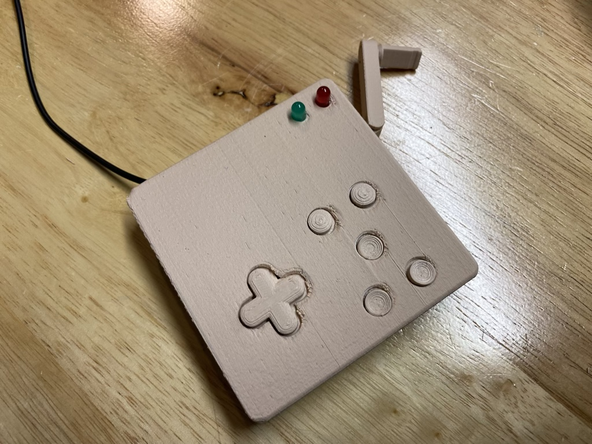
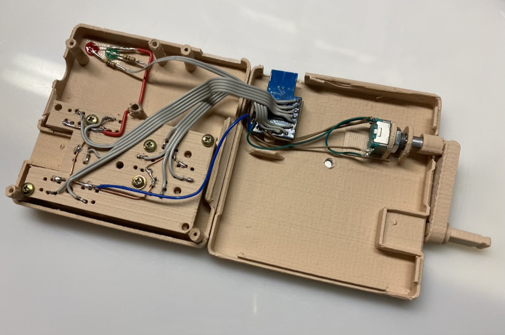

# Scrollytroller
A crank-based controller for use with PlayDate's Pulp web player development tool

This is a USB controller that lets you try out your PlayDate Pulp games with a more accurate 
user interface, compared with using your keyboard.

The controller generates keyboard presses and mouse scroll wheel events so that the 
Pulp web player will interact with it properly.  (I added more buttons and the LEDs because I 
had the space and thought they might be useful.)

The current mouse+keyboard configuration is:

- Crank generates mouse scroll wheel events
- D-Pad generates keyboard arrow key press events
- A and B buttons - generate keyboard 'a' and 's' events
- C button (in the middle) - not used 
- D and E bottom buttons - generate 'cmd'-'s' to save and 'cmd'-'b' to toggle between the player and the editor

In general use, just the green LED will be lit.
You can switch it into "joystick" mode by pushing in the crank button.  The red LED will light up.
While in this config mode, you can turn the crank to reset it, to match the web player.
You can also press the A and B buttons to switch output modes.  The green LED should be off after
you first power up the unit.  This indicates that you're in keyboard+mouse mode.  Press the B button
to switch to Joystick mode.  The green LED will be lit.

The current joystick configuration is:
- D-Pad generates output on axis 0 (x) and axis 1 (y)
- A,B,D,E buttons will generate presses on buttons 0,1,2,3 respectively
- Crank will output on axis 2, and the range of the axis corresponds to one full revolution of the crank

The code is written with the Arduino tools, and requires the Encoder library from PJRC, and the
joystick library from Matthew Heironimus. The urls for these libraries can be found in the source
code, and may be able to be installed through the Arduino Library manager.

This project requires an Arduino board with an ATmega 32u4 chip - Leonardo, Pro Micro, or in
my case, I used the "SS Micro" clone board because I like the formfactor.

The connection details are in the Arduino source code.  But the short of it is that 
all button io is configured using the 32u4's internal pullups, so none are needed
in the external wiring.  All connections go directly to the buttons.  The "other pin" 
on the buttons go to a common ground.  LEDs are wired up in a "source" configuration
where a HIGH from the Arduino will turn the LEDs on.  I used a 510 ohm resistor on each
to keep the current (and brightness) down quite a bit.

The 3D model started out as the Adafruit "Crankbox" model on Thingiverse.  I widened
it, and created the D-Pad and buttons, as well as mounting standoffs so that it can
be screwed together.  My printed device is all my parts, other than the assembled-when-printed
crank assembly.

